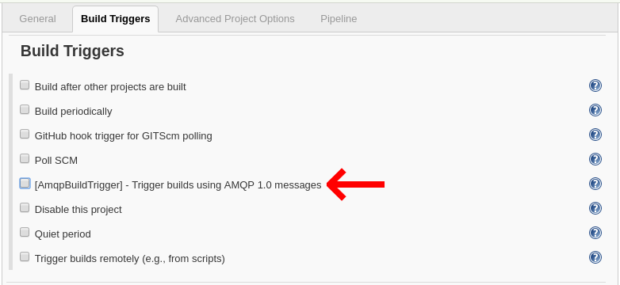

# AMQP Build Trigger for Jenkins
This Jenkins plugin will trigger builds when AMQP messages are received from AMQP message sources (typically a broker with a queue or topic). Each job may specify one or more AMQP sources from which to recieve messages. If any AMQP message is received from any of the configured sources, then a build is triggered.

## Building and Installing
After cloning from Github, use maven to build the package with the command `mvn package`. The compiled package will be located at `target\amqp-build-trigger.hpi`.

To install, make the hpi file available on the Jenkins machine and install using the Jenkins package manager. Select:

**Manage Jenkins** -> **Manage Plugins**

then select the **Advanced** tab. Under the **Upload Plugin** section, select the hpi file.

After a restart, the plugin should be active in Jenkins.

## Basic Configuration
Within each job, scroll down to the **Build Triggers** section (or click on the **Build Triggers** tab) and then locate the **[AmqpBuildTrigger]** checkbox. Select the **[AmqpBuildTrigger]** checkbox to enable the trigger.



Each job may specify multiple AMQP sources for trigger messages. Initially, the list will be empty. Click the **Add** button to add an AMQP trigger source.


This will create a new empty server parameters block. To complete this block:

* Enter the **URL** in the format `amqp://ip-addr[:port]`, eg `amqp://localhost` or `amqp://localhost:5672` or `amqp://10.0.0.5:35672`
* If necessary, enter a **User** and **Password** for logging onto the server. If supplied, the connection will use SASL `PLAIN` authentication, otherwise if left blank, `ANONYMOUS`. Make sure the server is configured for this type of access and that the user is known to it.
* Enter a **Source address** from which to receive messages. If the server is a broker, then this is usually the name of a queue or topic.


* A **Test Source** button if clicked will establish a temporary connection to the server and report `Connection ok` if it worked, otherwise an error message will be displayed.

To add additional sources, click the **Add** button. To remove a source, click the red **X** button at the top of each block.

Finally, click the **Save** button at the bottom of the form to save the settings. Once these settings are saved, a new connection to each server will be established and a listener will wait for messages.

**NOTE:** It is possible to perform a simple test of the trigger by using the maven command `mvn hpi:run` from the project top level directory. This will start a simplified version of Jenkins on a Jetty server instance, and the trigger plugin will be installed and running. Only Freestyle projects are available, but it makes for a quick and easy way of testing the trigger. The web interface will be available on `localhost:8080/jenkins`, and all jenkins logs, project files, etc. will be located in the project top-level directory under `work`.

**NOTE:** It is possible to quickly send trigger messages using `qpid-send` through a broker running on localhost as follows (to which the trigger must be configured to listen):
```
qpid-send [-b <broker-url>] -a <queue-name> -m1
```
where `<broker-url>` is the broker URL (defaults to `localhost`), and `<queue-name>` is replaced by the queue name configured in the **Source Address** field for your project. To get help, use `qpid-send -h` or `qpid-send --help`.
